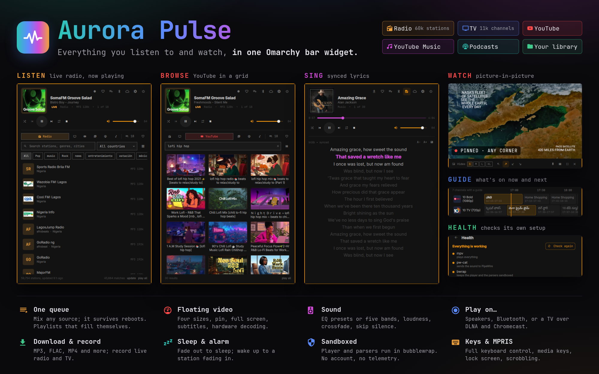

# AuroraPulse for Omarchy

Radio, TV, YouTube, YouTube Music, podcasts and your own music and videos in
one bar widget: one queue, one set of controls, a picture-in-picture video
window, synced lyrics and a TV guide.



Everything that touches the network or decodes media runs in a bubblewrap
sandbox. The widget itself only renders JSON from a daemon.

## Install

```bash
omarchy plugin add /path/to/this/repo     # from a checkout
omarchy plugin enable aurora-pulse
```

Pick **AuroraPulse** in the bar, then click its icon. If anything it needs is
missing - and on the very first run, anything it could use - a banner says
what, with **Install all** and **Review in Health**. Settings › Health lists
every dependency with an **Install** (or **Update**) button; installing opens
a terminal where you enter your password, and the page refreshes itself when
the packages arrive.

## What it does

**Sources**
- **Radio**: about 60,000 stations from Radio Browser, mirrored locally so
  browsing and search are instant; filter by country and genre; add your own
  stations or import M3U, PLS, JSON or CSV.
- **TV**: about 11,000 channels from iptv-org plus your own M3U playlists and
  channels, with a now/next guide and a full guide grid.
- **YouTube** and **YouTube Music**: search with endless scrolling, playlists
  and channels, video or audio only.
- **Podcasts**: search the directory, subscribe by feed, play or download
  episodes.
- **Local**: your music and video folders, browsed as songs, albums, artists,
  genres or folders.

**Playing**
- A queue across every source, kept across reboots.
- Favourites, recently played, and **playlists**: your own (reorderable), plus
  Most played, Recently played, Recently added and Favourites, which fill
  themselves.
- Resume long tracks where you left off; playback speed; repeat and shuffle.
- **Sound**: equalizer presets or five custom bands, loudness levelling, fade
  between tracks, skip silence, and a remembered volume for each output
  (speakers, headphones, Bluetooth).
- **Video**: a floating window that opens in its corner on the screen you
  choose, in four sizes, pinnable and full-screenable; hardware decoding;
  picture shape (16:9, 4:3, 21:9, fill); **picture quality** (SD, HD, Full HD)
  for channels that offer several, switched live and remembered; **subtitles**
  from YouTube, from the file or from a `.srt` beside it, with size and track
  choice.
- **Lyrics**: synced where available, click a line to seek, three text sizes,
  save as an `.lrc` file.
- **Record** a radio or TV stream to a file.
- **Download** YouTube videos, songs and podcast episodes as MP4, MKV, WebM,
  MP3, M4A, Opus, FLAC or the original format, with artwork.
- **Play on…**: this computer's speakers, headphones or HDMI, a Bluetooth
  speaker (paired ones are connected for you), or a TV or network speaker over
  DLNA or Chromecast / Google TV. Only AuroraPulse's sound moves; other apps
  stay where they are.
- **Offline mode** one click away, next to the power button: no network at
  all, your own music and downloads keep playing.
- **Sleep timer** that fades out, and an **alarm** that wakes you with a
  station, fading in.
- Media keys, `playerctl` and the lock screen through MPRIS; scrobbling to
  ListenBrainz and Last.fm.

## Keyboard

While the panel is open and no text box has focus:

| Key | Does |
|---|---|
| ↑ ↓, Page Up/Down, Home/End | move through the list |
| Enter | play the selected row |
| A or Shift+Enter | add it to the queue |
| Space | play / pause |
| ← → | seek 10 s |
| + − or Shift+↑↓ | volume |
| N / P | next / previous |
| M, S, F | mute, stop, favourite |
| Q | the queue |
| / | search (↓ goes back to the results) |
| 1 – 5 | tabs |
| Esc | close |

From a terminal or a key binding:

```bash
omarchy-shell aurora-pulse toggle           # open or close the panel
omarchy-shell aurora-pulse playPause        # also stop, next, previous, mute …
omarchy-shell aurora-pulse tab local:albums # a tab, or a Local view
omarchy-shell aurora-pulse play "groove salad"
omarchy-shell aurora-pulse settings health
```

## Requirements

| Tool | Why | |
|---|---|---|
| `mpv` | playback | required |
| `pw-cat` (pipewire) | sound: the player writes raw PCM and has no audio server | required |
| `bubblewrap` | the sandbox | required |
| `ffmpeg` / `ffprobe` | tags, thumbnails, recording, conversion | required |
| `yt-dlp` | YouTube, YouTube Music, downloads (keep it up to date) | recommended |
| `hyprctl` | the video window | recommended |
| `wpctl` (wireplumber) | volume per output | optional |
| `python-gobject` | media keys and the lock screen (MPRIS) | optional |
| `xdg-user-dirs` | finding your Music and Videos folders | optional |
| `libpulse` (`pactl`) | "Play on" another output | optional |
| `bluez-utils` | connecting paired Bluetooth speakers | optional |
| `avahi` | finding Chromecasts and Google TVs | optional |

`./ap-ctl selftest` checks all of it, and enters a sandbox for real to ask the
process inside whether it is sealed. Settings › Health shows the same list,
and the daemon warns at launch (at most weekly) if yt-dlp is more than two
months old - YouTube changes often, and an old yt-dlp is the usual reason it
stops working.

## Where things are kept

| Path | |
|---|---|
| `~/.local/share/aurora-pulse/state.json` | settings |
| `~/.local/share/aurora-pulse/library.db` | favourites, history, playlists, queue, downloads, local index |
| `~/.local/share/aurora-pulse/catalogue.db` | the station and channel mirror |
| `~/Music/AuroraPulse`, `~/Videos/AuroraPulse` | downloads; recordings in `Music/AuroraPulse/Recordings` |

Older versions kept the library in `state.json`; it is moved into
`library.db` the first time this version starts.

## How it fits together

```
Omarchy shell (QML)
  │  JSON lines, one request or event per line
  ▼
ap-ctl daemon              state, network, decisions; MPRIS, downloads, casting
  │  spawns
  ▼
ap-ctl session             one player, a separate process that survives a shell reload
  ▼
bubblewrap
  ├── mpv --ao=pcm → stdout → pw-cat → PipeWire
  └── (video) mpv → its own Wayland window
```

See [docs/ARCHITECTURE.md](docs/ARCHITECTURE.md) for the rest, and
[docs/SECURITY.md](docs/SECURITY.md) for the security model.

## Security in one paragraph

The player runs in a bubblewrap sandbox with its own user, mount, PID and IPC
namespaces, no capabilities, no home directory, memory limits and a seccomp
filter. Its only route to the internet is a local proxy that re-checks every
address, so a redirect to `127.0.0.1` or a DNS rebind is refused. Tag readers,
thumbnailers and the podcast feed parser run sandboxed with no network,
seeing only the file they read. yt-dlp runs sandboxed with network but no
files except the folder it downloads into. Casting is the one feature that
talks to your local network, and only to devices that answered a discovery
search. Every string from a remote source is sanitised before it reaches QML.

## Development

```bash
./ap-ctl selftest                          # does this machine work at all
for t in tests/test_*.py; do python3 $t; done
AP_LIVE_LOAD=1 python3 tests/test_panel_load.py   # restarts the shell
tools/dev-sync.sh --check                  # what would change in the live plugin
tools/dev-sync.sh                          # sync and reload
omarchy-restart-shell                      # after QML changes: the shell caches compiled QML
```

## Privacy

- No account and no telemetry. Plays of directory stations are reported to
  Radio Browser (anonymously; it is how stations are ranked) unless you turn
  that off in Settings › Radio.
- Signing in to YouTube is deliberately not supported; paste channel and
  playlist links instead.
- Scrobbling sends what you play to ListenBrainz or Last.fm only when you
  turn it on and give it a token.

## License

MIT, see [LICENSE](LICENSE).
